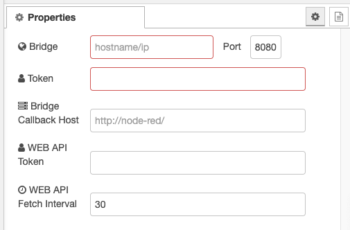

# node-red-contrib-nuki

[](https://greenkeeper.io/)


This node can control Nuki Smart Locks with the help of Nuki Bridges.
Also Nuki Bridges can be handled by the node. It uses [nuki-bridge-api](https://github.com/Mik13/nuki-bridge-api/) based on the Nuki Bridge API documentation.

It enables you to connecto to your Nuki Smart Lock over a Nuki Bridge and control it directly from node-red.
It also enables you to monitor the states and control the bridge itself.

## Installation

### Nuki Bridge API

How to get your hardware bridge token, which is a requirement for this node:

* Call http://<bridge_ip>:<bridge_port>/auth from any browser in your network. The bridge turns on its LED.
* Press the button of the bridge within 30 seconds.
* Result of the browser call should be something like this:
  ```
     {
       "token":"token123",
       "success":true
     }
  ```
* Use the generated token in the nuki-brige Configuration property **token**

### Nuki Web API

Do the following, to use the Nuki Web API - this is optional for this node!

* Retrieve a token at https://web.nuki.io/de/#/admin/web-api
* Use this token in the nuki-bridge Configuration on property **WEB API Token**
* Make sure your nuki devices are published on the Nuki Web API (use the Smartphone App via Settings Activate Nuki Web)


## Nodes


### Bridge Configuration

Configure a Nuki Bridge connection used by other nodes to communicate with the actual Nuki Bridge or Nuki Locks



| Config Item | Description |
|-|-|
| Bridge | IP or Hostname of your actual Bridge |
| Port | Default the bridge listens to 8080 |
| Token | your Token of the Bridge API Access |
| Bridge Callback Host | The actual node-red installation access - ***must*** be http, https is ***not*** supported |
| WEB API Token | Api Token to access the Nuki Web API ( web.nuki.io ) |
| WEB API Fetch Interval | The actual interval that is used to fetch data from web.nuki.io |

### Common Control on the Nodes

#### clearCallbacks

Removes all registered callbacks - if this option was configured

#### setupCallback

Registers the callback for the actual node ( bridge or nuki )

#### getCallbacks

Lists all registered callbacks - this is usefull if you get the error message that there are to many callbacks registered.

### Control In

Send commands and queries to a Nuki Smart Lock. At the moment 2 actions are available which can be set as **topic**

##### lockStatus

query the lockStatus of the current lock. Possible states can be reviewd at [state of nuki-bridge-api](https://github.com/Mik13/nuki-bridge-api/blob/master/lib/lock-state.js#L6). Those are at the moment
```
UNCALIBRATED
LOCKED
UNLOCKING
UNLOCKED
LOCKING
UNLATCHED
UNLOCKED_LOCK_N_GO
UNLATCHING
MOTOR_BLOCKED
UNDEFINED
```

#### lockAction

Performs an action on the current lock. Actions are not validated within the node if they are valid - e.g. the lock is already unlocked and you send an unlock again. In this case the bridge itself manages this and does not try to unlock again. Available actions are directly mapped to the [actions of nuki-bridge-api](https://github.com/Mik13/nuki-bridge-api/blob/master/lib/lock-action.js). At the moment those actions are:
```
UNLOCK
LOCK
UNLATCH
LOCK_N_GO
LOCK_N_GO_WITH_UNLATCH
```

#### webInfo

Query the information available from the WebAPI - if configured. Otherwise you just get no payload in the response

### Bridge Control

Send commands and queries to a Nuki Bridge.

The nuki bridge supports various commands. At the moment the responses are directly forwarded as output payload and are not parsed. They are only enriched with the original topic and bridge information ( host and port ).

#### reboot

Of course this action reboots the bridge itself

#### fwupdate

Update the firmware of the nuki bridge. It is not possible right now if there is an update available!

#### info

Retrieve information about the bridge. The payload looks like following example
```json
{"topic":"info","bridge":"192.168.1.100:8080","payload":{"bridgeType":1,"ids":{"hardwareId":234189529,"serverId":291317518},"versions":{"firmwareVersion":"1.12.6","wifiFirmwareVersion":"1.2.0"},"uptime":75492,"currentTime":"2019-05-09T08:09:20+00:00","serverConnected":true,"scanResults":[]},"_msgid":"e3cab797.caec98"}
```

#### log

Retrieve the current log from the bridge. Right now only the last 100 lines are reported even the api is available to page through the available logs

#### clearlog

Clear all logs on the bridge

## Todo

* Paging of Nuki Bridge logs
* Nuki Smart Lock Door sensor support ( missing in nuki-bridge-api )
* Nuki 3.0 Pro

## Caveats

At the moment the door sensor is not support within nuki-bridge-api.
